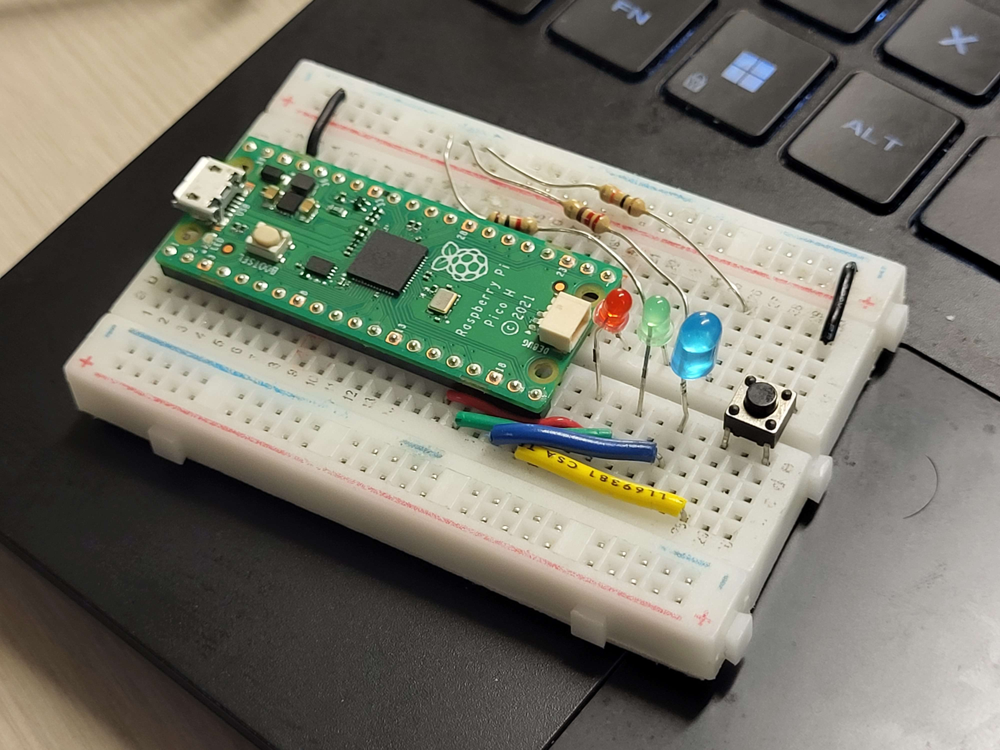

# Electrical Design: The Circuit

Our circuit has series LED-resistor pairs connected in parallel, with an additional wire for the button. The end of the wires are connected to the ground. A pin on the Raspberry PI microcontroller is able to sense the voltage change when the button is pressed. Since specification for each LED is different, we picked the resistors by trial-and-error to produce natural and not overly bright light. Initially all wires were black, and we changed the colors for powered wires to highlight each LED and button, as well as making the circuit more visually pleasing.

`circuit_sketch.png`: initial sketch of our circuit

`circuit_schematic.png`: more presentable version of our sketch

`circuit_v1_functional.mp4`: video demonstrating our first working assembled circuit

`circuit_v2.jpg`: replace jumper cables with stripped wires for cleanliness, and after tuning resistor values

`circuit_final.jpg`: final assembled circuit with meaningful cable colors

