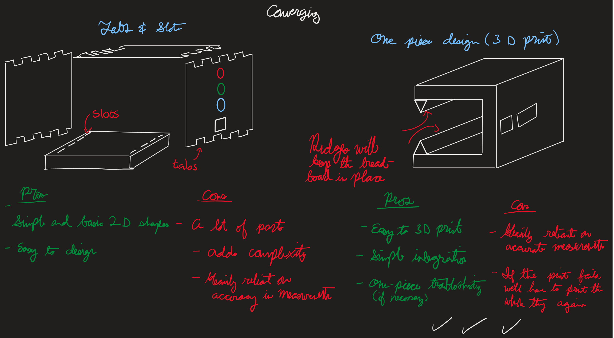
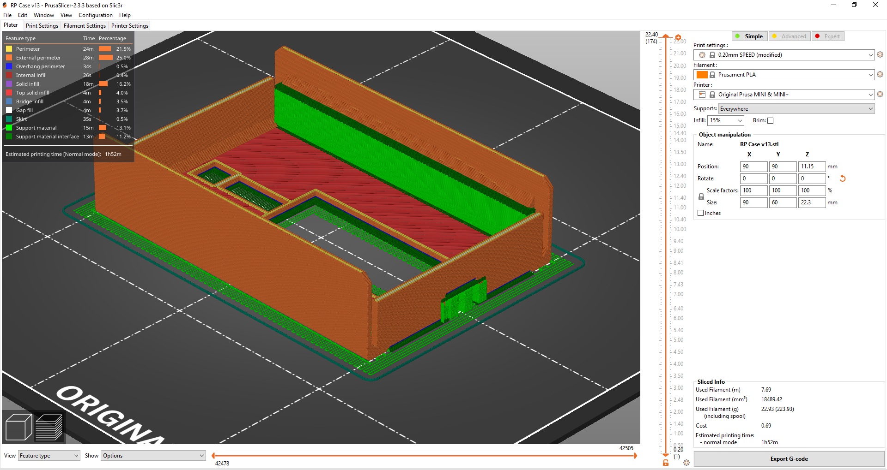
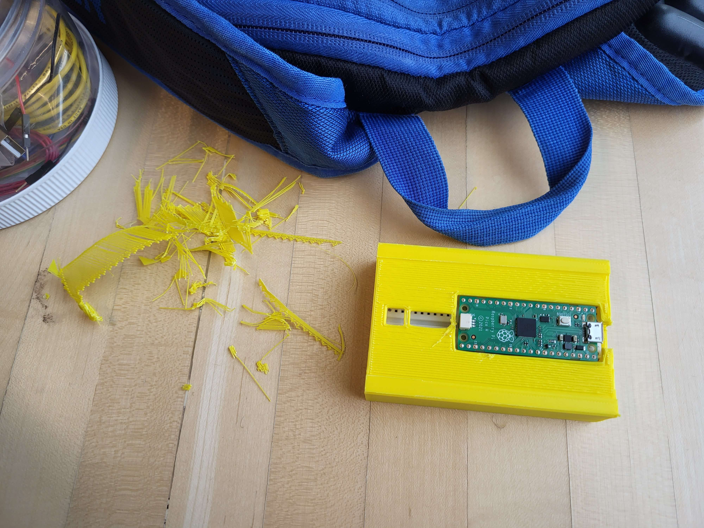

# Structural Design: The Container

For the container, we were provided with two design options: a 3D printing of a CAD model created in Fusion 360, and a container constructed from laser-cut pieces from vector illustration. We converged to 3D printed CAD model design as it has fewer parts and therefore is easier to manufacture and more reliable, as well as its flexibility to create fairly detailed shapes. For the same reason, we made the CAD model consisting of only one piece with a clip that fixes the breadboard while flexible for minor size mismatch.

When designing the CAD model, we found the dimension from measuring the assembled breadboard. Changes we made during the iterative design process include moving the LED slot to fit circuit change, adding triangular structure at the seam to improve strength, removing the sharp angles to prevent accidental scratching, and adjusting board thickness to balance easily bending and strength.

`structural_diverging_sketch.png`: our first sketch; our TA recommended including it in our dossier

`structural_divergence.png`: our diverging process

`structural_convergence.png`: our converging process

`structural_measurements.jpg`: measurement of dimensions for the CAD model

`container_intermediate.png`: initial CAD model before aforementioned changes

`container_final_cad.png`: screenshot of our final CAD model in Fusion 360

`container_final_slicer.png`: screenshot of our CAD model in Prusa Slicer for 3D printing

`model.f3d`, `model.stl`, `model.3mf`: our CAD model and fabricated 

`myfab_receipt.png`, `myfab_pick_up.png`: screenshot of emails from MyFab

`container_print_post_processing.jpg`: scraping the supports after 3D printing

